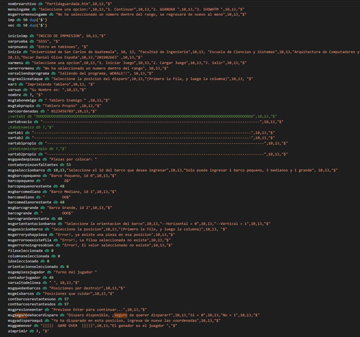

> Universidad de San Carlos de Guatemala    

> Facultad de Ingeniería 

> Escuela de Ciencias y Sistemas 

> Manejo e Implementación de Archivos 

> Vacaciones del Segundo Semestre 

> Ing. Oscar Paz 

> Tutor Académico: Diego Obín

Oscar Daniel Oliva España  - 201902663

# **PROYECTO 2 - Manual de Usuario**

## Objetivos

Realizar una aplicación web de servicio de gestión de viajes, que esté almacenada en la nube de AWS en instancias de tipo EC2.
Desde la que se pueda consumir el Backened por medio del frontend, ambas en la nube.

    

## Arquitectura Utilizada
Se utilizaron los servicios de AWS:
- Cognito: Para que los usuarios creados se puedan confirmar por medio del correo eléctrónico deseado, para que solamente los usuarios ingresados por este medio, podrán ingresar a la aplicación.
- EC2: Instancias por las cuales los servidores del BackEnd y el FrontEnd podrán ser almacenados y que cualquier persona pueda visitarlos, sin la necesidad de que se tenga una computadora encendida en todo momento, por medio de máquinas virtuales, en este caso con Sistema Operativo Ubuntu.
- IAM: Un usuario por el cual se decidirán las políticas que se podrá manejar dentro de los servicios de AWS.
  
De igual manera se utilizaron los servicios de Docker, con los cuales se subieron las imágenes de los proyectos, y de esa manera fuera fácilmente descargarlos y consumirlos dentro de las máquinas virtuales del EC2.

## Descripción de los usuarios IAM
En nuestro caso solamente se utilizó un usuario IAM