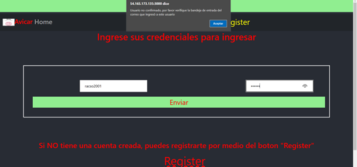
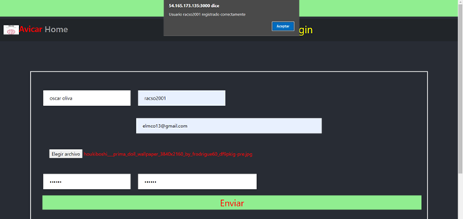

> Universidad de San Carlos de Guatemala    

> Facultad de Ingeniería 

> Escuela de Ciencias y Sistemas 

> Manejo e Implementación de Archivos 

> Vacaciones del Segundo Semestre 

> Ing. Oscar Paz 

> Tutor Académico: Diego Obín

Oscar Daniel Oliva España  - 201902663

# **PROYECTO 2 - Manual de Usuario**

## Cómo jugar

Al abrir la aplicación lo primero que se mostrará en pantalla, serán los datos del creador, deberá de presionar ENTER para continuar.
## Login

    

    

## Mensaje de COnfirmación

    

    

## Usuario Administrador

    

## Registro de Viajes

    

## Mensaje de Confirmación

    

## Viajes Disponibles

    

## Registro de Carros

    

    

    

## Registro de Usuarios

    

    

## Usuario Turista

    

## Vijes Di

    

    

    

    

    

